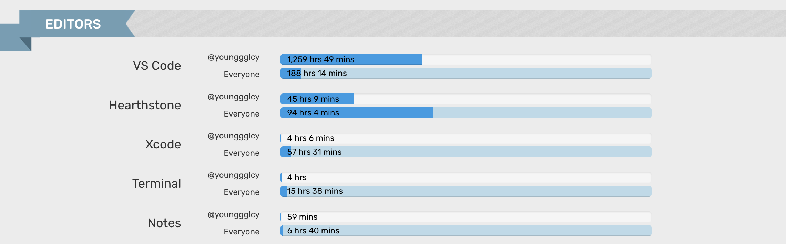

[[toc]]

## 前言

> 当你随便打开一个 App 就看到首页弹「年度总结」之类的东西，你就知道新的一年马上就要到了

本文也可视为一篇年终总结，我会把一些回顾整年的东西放进去，这样就省得再写一篇了。此文写作始于 12 月 24 日，终于 1 月 6 日，再者写作思路也比较跳脱，因此行文上难免有混乱不通之处

## 生活向

月底，工作上没特别忙，再加上睡眠稍微好了起来，总算是在下班后抽出时间去健身了。已经有整整 3 个月没有规律健身了，于是一练就获得久违的，如同第一次踏进健身房般的感觉 —— 超级无力，容量超级小，刚开始没几组肌肉就酸痛得不行了

我并不是个热爱健身的人，因为之前尝试过努力增肌，发现对我来说基本上没效果，力量水平也很快就达到瓶颈而止步不前了，骨骼肌含量经过测量，也基本上没有变化 —— 不确定是方法不对，还是体质问题 —— 总之付出努力之后，没有得到与之匹配的正反馈，热情自然就下去了

今年重新开始规律健身的原因只有一个 —— 腰椎间盘突出。大概 22 年、23 年左右，身体就已经发出前兆预警了，在打完篮球之后右边足底会疼痛，不过当时并未在意。23 年年底去医院拍了 CT 正式确诊了腰突，好在从医学术语上来讲，属于最轻程度的「膨出」，并且也没经历过急性期发作。但即使这样，腰突仍十分影响日常生活和心情。由于我的重视程度日渐降低，病情逐渐恶化，今年 3 月到了最严重的阶段 —— 平时的不适感强烈，走路超过 10 分钟会疼痛到影响不行，走 15 分钟以上的话就会特别困难了。在那之后，我开始接触运动康复相关的知识，上相关的私教课，也切实感受到了运动康复的奥妙所在，认同它的理念。规律健身 + 康复是目前生活必不可少的一环，这样起码可以保证病情不继续恶化，至于让骨骼生理结构回到正常水平，我认为还是很困难的。今后也要多督促自己健身才行呐。右膝的病情也得到了有限程度的改善，平时打养生篮球已经够用了，强度再大估计就顶不住了。右膝这块整体感觉是软的，半月板也松，承接不了力量

生活节奏上，仍然没有让自己满意。作息没有真正稳定下来，留给自己「进化」—— 阅读、学习、思考 —— 的时间、空间不够多，还老喜欢拖延。比较好的是失眠情况已经改善了不少，前两年一个月总是有一两天晚上完全睡不着觉的，现在想来也许是和腰突引发的副交感神经过度兴奋有关

今年去了河源、惠州、潮汕地区、香港玩，我对于旅游一事向来没有多大兴趣，旅途给我带来的疲惫感要大于收获的快乐，不过开车自驾这个事情还挺好玩的，有点像篮球，只需要专心地做一件事情，抛开任何其他心绪，因此会感到简单而纯粹的乐趣。今年总共租特斯拉 Model Y 开了近一千公里，对驾驶体验总体而言是满意的，不过没开过其他电车，因此无法对比。我是坚定的 $TSLA 持有者，目前 $TSLA 也占了我最大仓位，但要在国内买车的话，我大概是不会考虑买 Tesla 的车的，因为实在不喜欢车机自带的百度地图。2026 的话，并没有想要去更多的地方走走看看，尽可能早买辆车的话倒是挺想的，希望早日实现

> 想吐槽一下深圳和广东的一些地方不设非机动车道 + 电动车乱窜，对交通对城市面貌都是毒害

说起股票，12 月靠 $RKLB 猛拉一波收益，今年股票账户的理财亏损收窄到了 20% 以内，2026 年的目标是回本。今年在理财方面做的是很失败，场外的话，盈利最多的是黄金，整体收益率也不是很高

本月宇宙战挨打上传，~~炉石传说真 nm 好玩~~。值得吐槽的是 Mac 平台上玩炉石体验实在不佳，动画经常卡成一坨

说起电子设备，目前手上的 14 inch, 16 GB, M1 Pro MBP 是靠实习所得 + 攒的钱于 23 年 3 月购入的二手货，最近也偶尔会觉得卡顿，加上 16 GB内存是有些不够用了，26 年会考虑买个新的 M5 MBP / Air / Mac Mini 用。去年年会中奖的 iPad，一直是轻中度使用 —— 在家当副屏，看 Bilibili，玩 COC(Clash Of Clans)。最近在家写码的时候反而愈发喜欢用单屏了，因此这个 iPad 没多少日常使用场景了，过段时间准备出掉了。相机的话，除了出去旅游之外，几乎都没用过，严重吃灰。不过也不后悔吧，毕竟是买了自己强烈想拥有的东西，在这种事情上越早买单越好

本月开始读《乔布斯传》。今年在读的书不少，读完的正经书只有以下几本

> 另外，今年在地铁通勤与碎片时间上居然花了几十个小时读网文（

- 《铸剑》—— 迅哥的短篇，半小时就囫囵吞枣地读完了
- 《马可瓦尔多》 —— 读起来感觉比较治愈的小说
- 《土星之环》—— 作者人文领域的造诣极深，引用典故都是以逻辑严密地形式交织。写作形态是意识流中的意识流，以至于我读起来非常吃力
- 《克莱因壶》 —— 20 世纪的一本日本科幻推理小说，文字版的《盗梦空间》

快读完的有雪球上的段永平语录合集。段至今仍然在雪球社区活跃，应该是普通人唯一能接触到的这个财富级别的大佬吧

今年似乎是没有任何一部看完的番剧或者电视剧啊...《日常》偶尔会拿出来看，看了十多话。*Breaking Bad* 自从闲鱼上拼的 Netflix 会员过期后就没继续看了，应该是几乎看完了前三季，个人感觉无愧于神剧之称，有机会的话考虑捡起来重新看。前端时间惊奇地发现 Bilibili 上官方渠道居然是上映了 *Better Call Saul* 的，看完毒师之后能去 B 站直接看律师。*Family Guy* 在抖音上看了超级多集，这剧实在是太搞太欢乐~~太逆天~~了

电影的话今年只看了几部，没有特别喜欢的

## 工作 & 技术向

今年做了挺多大需求的，其中做的最开心也是最满意的事情就是 [eczn](https://github.com/eczn) 带着我完成了数学公式这个格式在腾讯文档的研发落地，和 eczn 学到了很多知识。eczn 我的神！

职级晋升的话失败了，还是比较感到挫败的

输出的话，今年严重不足啊，反省一下。我至今仍然没有想好对于我个人，知识沉淀与维护的最佳实践是什么。尝试过数次 Obisidian，但总是因为各种各样的原因弃坑了。明年我应该会考虑定制化 Obisidian 或者直接用 Cherry Studio 吧。目前这块我的工作流十分原始人

- Typora 写技术博客，然后放到本博客的 Repo 下
- Apple Notes & Reminder 记一些 random things

AI 的发展，尤其对于程序员们来说，真的是今年当中一个跨时代的跃迁。我自己早期就是 GitHub Copilot 的年费用户，但逐渐感觉到它越来越不够好了，尤其是年底 Claude Opus 4.5 和 gptx 5.2 这类杀手级大模型面世后，Copilot 看起来已经掉队不少。不过还是得承认它依托于微软与 GitHub 生态，在这方面有得天独厚的优势，也许吧。我已经取消 Copilot 订阅，转向 cc 与 codex 了。由于 Anthropic 和 OpenAI 订阅服务对中国大陆不友好，我是从 API 中转商那里买了 API KEY 以使用这两家的 CLI 工具的

如果你恰巧读到了这篇博客并且也想使用 API KEY 以绕过订阅服务，你可以使用我的邀请码，这应该会让你省一点钱：
https://0011.ai/i/FWFRPEPG

我平时使用 AI 的方式也比较普通，没有什么花活，不过也在此记录一下，说不定过段时间又发生翻天覆地的变化了

手机上：偶尔问问 AI 生活上的问题，聊聊天，然后用 Grok 获取资讯/新闻

- ChatGPT
- Grok

电脑上：习惯使用 VSCode 作为 IDE 了，新 IDE 下载过来尝鲜之后，也就又切回 VSCode 了。从我的 [Wakatime 年度报告](https://wakatime.com/a-look-back-at-2025/3e4e5f80-9b41-4628-8af5-53eb45955be3/xviqfhvbqx)上也能看出我是 VSCode 重度用户


> 炉石传说还是玩少了！(逃

我使用 Claude Code / Codex 也都是在 VSCode 内使用，在这里晒一下我的 VSCode 配置
```json
// settings.json
"terminal.integrated.profiles.osx": {
  "bash": null,
  "zsh": {
    "path": "zsh",
  },
  "codex": {
    "path": "zsh",
    "args": ["-i", "-l", "-c", "codex --yolo"],
    "overrideName": true,
  },
  "claude": {
    "path": "zsh",
    "args": ["-i", "-l", "-c", "claude --dangerously-skip-permissions"],
    "overrideName": true,
  }
},
```
> 我的 VSCode settings 通用配置维护在这里： https://github.com/younggglcy/dotfiles/blob/main/.vscode/settings.json

这样的话，Command + Shift + P 跑 `Create New Terminal(With Profile)` 命令就能创建出叫 claude 或者 codex 的终端窗口，然后拖到上面的 Files 区域，按 Command + P 也能方便地在 CLI 终端和文件之间做跳转

当偶尔我希望只需要 CLI 运行，我个人完全不介入时，我会喜欢用 Ghostty

其他任何事情：用 Cherry Studio。之前我使用 LobeChat 的，后来才迁移过去，因为功能性上 Cherry Studio 更胜一筹。当然也并不是在吹 Cherry Studio 是万能的，只是它足够覆盖我的使用场景了

## 总结

这篇博客拖拖拉拉好久了，我想暂时就写到这吧。新的一年希望成为能力更强，更健康的人，与诸君共勉之！
