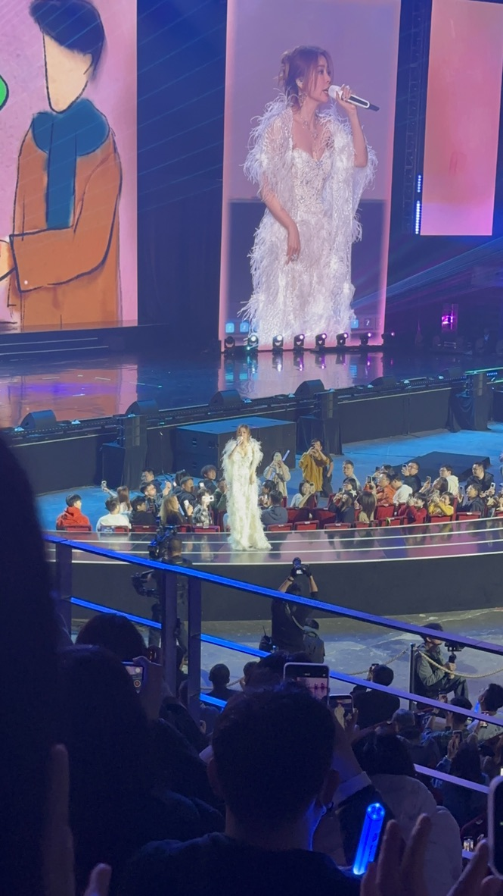

[[toc]]

## 身体康复

先写点开心的，去年年底恢复规律健身后也加入了运动康复的课程，身体状态好了些。力线比之前正了，尤其是下肢，结果是平时走路的不平衡感减轻很多。力量水平在逐步恢复中，但是工作日容易感到身体疲惫，恢复速度慢

## 生活 & 娱乐

这个月没出去玩，但是 26 号公司年会在现场见到了张靓颖，听了《如果这就是爱情》、《终于等到你》、《野心家》三首歌。本人超级美，唱歌超级好听，当场就粉上了！

> 想找照片放上的时候才发现没几张拍得可以的，iPhone 拍夜景不行😠

炉石本月上传说后组了两套宇宙法在 2k 多名划水，~~炉石传说真 nm 好玩~~

iPad 由于吃灰已久，出给司内同事了

## 工作

月底又忙起来了，连着两天干到凌晨 1 点半，烦

## 思考 & 记录

本月开始尝试用 Obisidian 作为个人知识体系管理的本地工具，效果觉得勉强还行。有不懂的地方问问各家 Agent，用用 NotebookLM，这倒还挺好用的

日常编程方面，本月开始用 Conductor / Superset 做一些不太需要我介入的工作，大量依赖人的工作仍在 VSCode 进行。手机上装了 Happy，去看年会的路上还体验了用它远程 Vibe Coding 的感觉，还挺爽的

面向用户的 Coding Agent 发展太快了，这也导致各种 Vibe Coding 出来的应用层出不穷，个人已经有些信息过载的感觉

未来会使用 Agent 的人会在更多领域占据优势，但人也至少要在比较懂的领域，才敢放手让 Agent 去做事情。正因如此我个人还是不喜欢完全把决策权交给 Agent。「注意力」是 Agent 横行的时代，人类所拥有的最宝贵资源

这个月想得多，动手得少。有一大片连续、空闲且属于自己的时间已经越来越难了

## 阅读

本月读了 4h+ 书，主要是在看《乔布斯传》，大概还有 60% 没读。令我意外的是乔布斯是个相当「混蛋」、人品奇差的人
