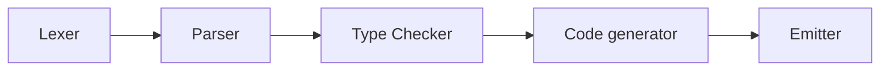
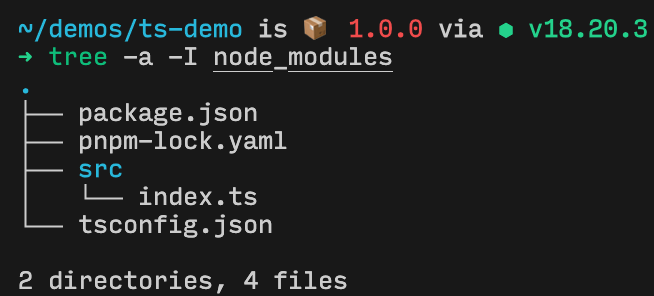

# 入门：了解装饰器

> 本章节首发于同事 [xcatliu](https://github.com/xcatliu) 的 [TypeScript 入门教程](https://ts.xcatliu.com/)，欢迎想了解或想对 TypeScript 有更深理解的你阅读~
> 

写在前面：本章只介绍 TypeScript 5.0+ 的装饰器用法，对于 5.0 以下的版本，请参考 [TypeScript 官方文档](https://www.typescriptlang.org/docs/handbook/decorators.html)

## 什么是装饰器

首先，什么是装饰器呢？[维基百科](https://en.wikipedia.org/wiki/Decorator_pattern)是这么说的：

> In [object-oriented programming](https://en.wikipedia.org/wiki/Object-oriented_programming), the **decorator pattern** is a [design pattern](https://en.wikipedia.org/wiki/Design_pattern_(computer_science)) that allows behavior to be added to an individual [object](https://en.wikipedia.org/wiki/Object_(computer_science)), dynamically, without affecting the behavior of other instances of the same [class](https://en.wikipedia.org/wiki/Class_(computer_science)).
> 

本人的蹩足翻译：在 OOP (面向对象编程)中，装饰器模式是一种允许动态地往一个对象上添加自定义行为，而又不影响该对象所属的类的其他实例的一种设计模式。

> 什么是 OOP 和类？[前面的章节](https://ts.xcatliu.com/advanced/class.html)做过介绍。
> 

这句话未免过于拗口了，我们不妨换个角度去切入。

## 装饰器的使用场景

要知道，一切设计模式的诞生，都是为了解决某个问题。在 JavaScript 的世界中，装饰器通常出现于以下场景：

1. 提供一种易读且容易实现的方式，修改类或者类的方法，避免出现大量重复的代码。
    
    下面以修改类的方法为例。
    
    首先，假设我们有一个 `Animal` 类：
    
    ```tsx
    class Animal {
      type: string
      constructor(type: string) {
        this.type = type
      }
      
      greet() {
        console.log(`Hello, I'm a(n) ${this.type}!`)
      }
    }
    
    const xcat = new Animal('cat')
    xcat.greet() // Hello, I'm a(n) cat!
    ```
    
    该类有一个 greet 方法，和调用方打招呼。
    
    假如说，我还希望根据不同的 `type`，往 console 打印不同动物的叫声呢？
    
    聪明的你或许想到了，这不就是**类的继承**吗！在子类的 `greet()` 方法中，实现不同的逻辑，再调用 `super.greet()` 即可。
    
    ```tsx
    class Xcat extends Animal {
      constructor() {
        super('cat')
      }
      
      greet() {
        console.log('meow~ meow~')
        super.greet()
      }
    }
    
    const xcat = new Xcat()
    xcat.greet() // meow~ meow~
                 // Hello, I'm a(n) cat!
    ```
    
    用装饰器实现，也不妨为一种思路，比如在 `Animal` 类中，为 `greet()` 方法添加「打印不同动物叫声的」行为:
    
    ```tsx
    class Animal {
      type: string
      constructor(type: string) {
        this.type = type
      }
    
      @yelling
      greet() {
        console.log(`Hello, I'm a(n) ${this.type}!`)
      }
    }
    
    const typeToYellingMap = {
      cat: 'meow~ meow~'
    }
    
    function yelling(originalMethod: any, context: ClassMethodDecoratorContext) {
      return function(...args: any[]) {
        console.log(typeToYellingMap[this.type])
        originalMethod.call(this, ...args)
      }
    }
    
    const xcat = new Animal('cat')
    xcat.greet() // meow~ meow~
                 // Hello, I'm a(n) cat!
    ```
    
    在 `Animal.greet()` 方法上出现的 `@yelling` ，就是 TypeScript 中装饰器的写法，即 @ + 函数名的组合。
    
    上述示例对装饰器的应用属于**方法装饰器**，此类装饰器本身接收两个参数，一是被装饰的方法，二是方法装饰器的上下文。方法装饰器应返回一个函数，此函数在运行时真正被执行。在上述例子中，我们在装饰器返回的函数中做了两件事情：
    
    1. 打印相应类别的动物的叫声。
    2. 调用 `originalMethod.call(this, …args)` ，确保原方法（即装饰器所装饰的方法）能够正确地被执行。
2. 结合「**依赖注入**」这一设计模式，优化模块与 class 的依赖关系。
    
    什么是依赖注入呢？引用同事 [zio](https://github.com/ziofat) 的原话：
    
    > **依赖注入其实是将一个模块所依赖的部分作为参数传入，而不是由模块自己去构造。**
    > 
    
    可见，依赖注入解决了实际工程项目中，类、模块间依赖关系层级复杂的问题，将构造单例的行为交由实现依赖注入的框架去处理。
    
    举个例子：
    
    ```tsx
    @injectable
    class Dog implements IAnimal {
      sayHi() {
        console.log('woof woof woof')
      }
    }
    
    @injectable
    class Cat implements IAnimal {
      sayHi() {
        console.log('meow meow meow')
      }
    }
    
    class AnimalService {
      constructor(
        @inject dog: Dog
        @inject cat: Cat
      ) {
        this._dog = dog
        this._cat = cat
      }
      
      sayHiByDog() {
        this._dog.sayHi()
      }
      
      sayHiByCat() {
        this._cat.sayHi()
      }
    }
    ```
    
    在上述代码中，`@injectable` 将一个类标记为「可被注入的」，在面向业务的类（即 `AnimalService`）中，使用 `@inject` 注入此类的单例，实现了「依赖倒置」。注意到这里的 `implements IAnimal` 用法，也是实战中依赖注入运用的精妙之处 —— 关心接口，而非具体实现。
    
3. 实现「AOP」，即 Aspect-oriented programming，面向切面编程。
    
    所谓的「切面」，可以理解成，在复杂的各个业务维度中，只关注一个维度的事务。
    
    例如，使用装饰器，实现对类的某个方法的执行时间记录：
    
    ```tsx
    class MyService {
      @recordExecution
      myFn() {
        // do something...
      }
    }
    
    function recordExecution(originalMethod: any, context: ClassMethodDecoratorContext) {
      return function(...args: any[]) {
        console.time('mark execution')
        originalMethod.call(this, ...args)
        console.timeEnd('mark execution')
      }
    }
    ```
    

## 装饰器的类别

通过以上例子，相信读者已经对装饰器有一定了解，且认识到了装饰器在一些场景的强大之处。在此引用[阮一峰 es6 教程](https://es6.ruanyifeng.com/#docs/decorator#%E7%AE%80%E4%BB%8B%EF%BC%88%E6%96%B0%E8%AF%AD%E6%B3%95%EF%BC%89)稍做总结：

> 装饰器是一种函数，写成`@ + 函数名`，可以用来装饰四种类型的值。
> 
> - 类
> - 类的属性
> - 类的方法
> - 属性存取器（accessor, getter, setter）

> 装饰器的执行步骤如下。
> 
> 1. 计算各个装饰器的值，按照从左到右，从上到下的顺序。
> 2. 调用方法装饰器。
> 3. 调用类装饰器。

不管是哪种类型的装饰器，它们的函数签名都可以认为是一致的，即均接收 `value`, `context` 两个参数，前者指被装饰的对象，后者指一个存储了上下文信息的对象。

## context 与 metadata 二三讲

四种装饰器的 context，均包含以下信息：

- kind
    
    描述被装饰的 value 的类型，可取 `class`, `method`, `field`, `getter`, `setter`, `accessor` 这些值。
    
- name
    
    描述被装饰的 value 的名字。
    
- addInitializer
    
    一个方法，接收一个回调函数，使得开发者可以侵入 value 的初始化过程作修改。
    
    对 `class` 来说，这个回调函数会在类定义最终确认后调用，即相当于在初始化过程的最后一步。
    
    对其他的 value 来说，如果是被 `static` 所修饰的，则会在类定义期间被调用，且早于其他静态属性的赋值过程；否则，会在类初始化期间被调用，且早于 value 自身的初始化。
    
    以下是 `@bound` 类方法装饰器的例子，该装饰器自动为方法绑定 `this`：
    
    ```tsx
    const bound = (value, context: ClassMemberDecoratorContext) {
      if (context.private) throw new TypeError("Not supported on private methods.");
      context.addInitializer(function () {
          this[context.name] = this[context.name].bind(this);
      });
    }
    ```
    
- metadata
    
    和装饰器类似，[metadata](https://github.com/tc39/proposal-decorator-metadata) 也是处于 stage 3 阶段的一个提案。装饰器只能访问到类原型链、类实例的相关数据，而 metadata 给了开发者更大的自由，让程序于运行时访问到编译时决定的元数据。
    
    举个例子：
    
    ```tsx
    function meta(key, value) {
      return (_, context) => {
        context.metadata[key] = value;
      };
    }
    
    @meta('a', 'x')
    class C {
      @meta('b', 'y')
      m() {}
    }
    
    C[Symbol.metadata].a; // 'x'
    C[Symbol.metadata].b; // 'y'
    ```
    
    在上述程序中，我们通过访问类的 `Symbol.metadata` ，读取到了 meta 装饰器所写入的元数据。对元数据的访问，有且仅有这一种形式。
    
    注意一点，metadata 是作用在类上的，即使它的位置在类方法上。想实现细粒度的元数据存储，可以考虑手动维护若干 `WeakMap`。
    

除了类装饰器以外，其他3种装饰器的 context 还拥有以下 3 个字段：

- static
    
    布尔值，描述 value 是否为 static 所修饰。
    
- private
    
    布尔值，描述 value 是否为 private 所修饰。
    
- access
    
    一个对象，可在运行时访问 value 相关数据。
    
    以类方法装饰器为例，用 `access.get` 可在运行时读取方法值，`access.has` 可在运行时查询对象上是否有某方法，举个例子：
    
    ```tsx
    const typeToYellingMap = {
      cat: 'meow~ meow~',
    }
    
    let yellingMethodContext: ClassMethodDecoratorContext
    
    class Animal {
      type: string
      constructor(type: string) {
        this.type = type
      }
    
      @yelling
      greet() {
        console.log(`Hello, I'm a(n) ${this.type}!`)
      }
    
      accessor y = 1
    }
    
    function yelling(originalMethod: any, context: ClassMethodDecoratorContext) {
      yellingMethodContext = context
      return function (this: any, ...args: any[]) {
        console.log(typeToYellingMap[this.type as keyof typeof typeToYellingMap])
        originalMethod.call(this, ...args)
      }
    }
    
    const xcat = new Animal('cat')
    xcat.greet() // meow~ meow~
    // Hello, I'm a(n) cat!
    yellingMethodContext.access.get(xcat).call(xcat) // meow~ meow~
    // Hello, I'm a(n) cat!
    console.log(yellingMethodContext.access.has(xcat)) // true
    ```
    
    `getter` 类别的装饰器，其 `context.access` 同样拥有 `has`, `get` 两个方法。
    
    对于 `setter` 类别的装饰器，则是 `has` 与 `set` 方法。
    
    `filed` 与 `accessor` 类别的装饰器，拥有 `has`, `get`, `set` 全部三个方法。
    

# 进阶：one step further

## 了解装饰器提案的演进

在「入门」章节的开头，有提到该章只介绍 TS 5.0+ 的装饰器实现。这是因为，TS 5.0+ 的装饰器是对 [stage3 装饰器草案](https://github.com/tc39/proposal-decorators/blob/a81149ffa1253601329b64542123ac52f839d139/README.md)的实现，而 TS < 5.0 的装饰器是对 [stage2 装饰器草案](https://tc39.es/proposal-decorators/)的实现。

### 简单介绍 TS < 5.0 装饰器

在 <5.0 的版本，需要在 `tscofig.json` 的 [**`compilerOptions`](https://www.typescriptlang.org/tsconfig#compilerOptions)** 选项中，声明 `"[experimentalDecorators](https://www.typescriptlang.org/tsconfig#experimentalDecorators)": true` ，才能让 stage2 装饰器生效。

和 stage3 装饰器不同的，有以下几点：

> 推荐阅读： [https://github.com/tc39/proposal-decorators?tab=readme-ov-file#how-does-this-proposal-compare-to-other-versions-of-decorators](https://github.com/tc39/proposal-decorators?tab=readme-ov-file#how-does-this-proposal-compare-to-other-versions-of-decorators)
> 
1. stage2 装饰器多出了 `parameter decorator` ，也即类中的参数装饰器，可用于类的构造函数或者方法中。
    
    举个用法上的例子，在这里我们不关注具体实现。
    
    ```tsx
    class FontController {
      // 给富文本编辑器选取中的文字加粗
      bold(
        @Editor editor: unknown   // 主要关注这一行
      ) {
        return editor.formats.bold(editor.getRange())
      }
    }
    ```
    
2. stage2 装饰器的写法更复杂，更难记，类型支持不太好。
3. stage2 装饰器中的 `target` ，是所修饰的类或者其原型链，而 stage3 装饰器并未暴露出直接操作类本身的能力，在设计上更为合理。
    
    > 事实上，类成员上的装饰器所修饰的，均是类的原型链，而带有 `static` 的类成员，其装饰器所修饰的是类本身。
    > 
4. stage2 装饰器对 `target` 的侵入，是通过拿到 `descriptor` 并对其操作而实现的，而 stage3 通过 `context` ，只对外暴露必要接口，在设计上更为合理。
5. stage2 装饰器会先跑作用在实例上的装饰器，再跑 `static` 装饰器，而 stage3 装饰器的顺序完全由程序所决定

综合来看，从 stage2 到 stage3，装饰器提案做出了许多好的改进。笔者唯一的槽点是，参数装饰器被去掉了。

## 使用 TS Playground 分析原理

对背景知识有所了解后，我们可以借助 TypeScript Playground，查看编译出来的 JavaScript 代码，来剖析装饰器的实现原理。

以上文最近的一个完整代码片段为例子，TypeScript Playground 链接在[这里](https://www.typescriptlang.org/play/?#code/MYewdgzgLgBFCeAHApgFRATWQG2wSzAHMBZAQ0RgF4YBvAKBhmFKgC4YByAW2RAHcAfjB78BHADR0AvnTrZkseDnxFiCgBYgAJgGFwUZAA82MHdlIQIaqJq0ARZKABOLEE71gDx2cHOWYAIJgeFyk2LQMcEjI7NBOBISRoJBQTgCuwFBuABQIKLGpCQCUEYyMNngQAHR5yFRRKJEykQACSrgJkYROyArZJfRlTOAQIPJV2CCE2QAGABLKIOIwAJLcMKTZYCUAJDQV1bVSAIQzRU2yjKTAwMiWbjDw9QCM0rIAZmlgmXjgj8oJbJuPCEAhhay2dikMDwZbJLwmMwWKwabQOZyudz6IxQAaRdoqEio3TY4z1eE4yI9KBpJxgGCfb5QX703LqSpQmHLKo80hOQgQTnwADaAF08UNkqNxpNprV0FgOqpyMKDjVohsIDAANbIeAgd4NXiG+WYAHKxDiyKMYGgsDg4lVZi4NmVbm8-kQc6MGTNKWwQzMWDUMDIPiBYKhbDZDhBjjnQMsKrdXpQfowAD0GeEvEEOdEdCzMAWuCWq3Wm22TBYxzoBISEO0HgRVWut0syb6idxTrC0e7JSLIjzw4EhezJcmyzWXA2WxKQdrUrGyAmU2y9dUxObONbNzu1XUFmyA8H2dSaWQdCAA)，可以发现，核心在于 `__esDecorate` 函数的实现与使用。其代码如下：

```tsx
// 关注此方法 ⬇️
var __esDecorate = (this && this.__esDecorate) || function (ctor, descriptorIn, decorators, contextIn, initializers, extraInitializers) {
    function accept(f) { if (f !== void 0 && typeof f !== "function") throw new TypeError("Function expected"); return f; }
    var kind = contextIn.kind, key = kind === "getter" ? "get" : kind === "setter" ? "set" : "value";
    var target = !descriptorIn && ctor ? contextIn["static"] ? ctor : ctor.prototype : null;
    var descriptor = descriptorIn || (target ? Object.getOwnPropertyDescriptor(target, contextIn.name) : {});
    var _, done = false;
    for (var i = decorators.length - 1; i >= 0; i--) {
        var context = {};
        for (var p in contextIn) context[p] = p === "access" ? {} : contextIn[p];
        for (var p in contextIn.access) context.access[p] = contextIn.access[p];
        context.addInitializer = function (f) { if (done) throw new TypeError("Cannot add initializers after decoration has completed"); extraInitializers.push(accept(f || null)); };
        var result = (0, decorators[i])(kind === "accessor" ? { get: descriptor.get, set: descriptor.set } : descriptor[key], context);
        if (kind === "accessor") {
            if (result === void 0) continue;
            if (result === null || typeof result !== "object") throw new TypeError("Object expected");
            if (_ = accept(result.get)) descriptor.get = _;
            if (_ = accept(result.set)) descriptor.set = _;
            if (_ = accept(result.init)) initializers.unshift(_);
        }
        else if (_ = accept(result)) {
            if (kind === "field") initializers.unshift(_);
            else descriptor[key] = _;
        }
    }
    if (target) Object.defineProperty(target, contextIn.name, descriptor);
    done = true;
};

let Animal = (() => {
    var _a, _Animal_y_accessor_storage;
    let _instanceExtraInitializers = [];
    let _greet_decorators;
    return _a = class Animal {
            constructor(type) {
                this.type = __runInitializers(this, _instanceExtraInitializers);
                _Animal_y_accessor_storage.set(this, 1);
                this.type = type;
            }
            greet() {
                console.log(`Hello, I'm a(n) ${this.type}!`);
            }
            get y() { return __classPrivateFieldGet(this, _Animal_y_accessor_storage, "f"); }
            set y(value) { __classPrivateFieldSet(this, _Animal_y_accessor_storage, value, "f"); }
        },
        _Animal_y_accessor_storage = new WeakMap(),
        (() => {
            const _metadata = typeof Symbol === "function" && Symbol.metadata ? Object.create(null) : void 0;
            _greet_decorators = [yelling];
            // 关注这里 ⬇️
            __esDecorate(_a, null, _greet_decorators, { kind: "method", name: "greet", static: false, private: false, access: { has: obj => "greet" in obj, get: obj => obj.greet }, metadata: _metadata }, null, _instanceExtraInitializers);
            // 关注这里 ⬆️
            if (_metadata) Object.defineProperty(_a, Symbol.metadata, { enumerable: true, configurable: true, writable: true, value: _metadata });
        })(),
        _a;
})();
```

### 函数签名

```tsx
function (ctor, descriptorIn, decorators, contextIn, initializers, extraInitializers) {
  // do something...
}
```

- `ctor` ，表示类的构造函数。
- `descriptorIn` ，表示现有的被装饰的属性的 descriptor，可以为空。
- `decorators` ，表示装饰器函数数组，因为装饰器可以存在多个。
- `contextIn` ，表示装饰器的 context 信息，何为 context 上文有简单介绍。
- `initializers` ，与函数外部的初始化逻辑相关，暂时忽略。
- `extraInitializers` ，与函数外部的初始化逻辑相关，暂时忽略。

### 函数主体

在函数主体部分，主要做的逻辑就是，根据 context 上下文信息，拿到 `descriptor` 和其他相关变量，然后从后往前遍历装饰器，在每个循环，都创建一个独立的 context，和 descriptor 一起作为参数，传给装饰器并调用得到结果，最后更新 descriptor。

可见在语言层面，装饰器的实现本质上还是通过操作 `descriptor` 而实现的。

# 深入：TypeScript 源码阅读

在上一章，我们从 TS Playground 看到了 TS 编译后的产物。但好奇的你可能会继续发问：TS 是如何将代码编译成这个样子的呢？TS 对于装饰器语法，在编译器内，又是如何处理的呢？那这个时候，我们就需要 clone TS 源码过来阅读一下了。


附上 TS/C# 作者 Anders 在数年前一场关于现代编译器架构的 Talk 中，手绘的一张图。



对于编译原理，相信各位学得一定比笔者更好，笔者在此便不班门弄斧了。对于装饰器相关实现而言，我们更关心这里 `Lexer`, `Parser` 整体上是如何把装饰器代码处理为 AST Node 的，以及 AST Node 是如何被转换到生成的 JavaScript 产物的。

TypeScript 的源码相对比较多，深究技术细节的话，可能很容易一天就过去了。按笔者的经验，打 debugger 调试是切入并了解复杂项目，最有效的手段。

## setup

笔者选择的方式比较笨，是直接在 TS 源码中，写上 `debugger` ，再使用 `hereby local` 命令将编译器产物输出到本地，最后使用产物中的 `tsc.js` ，调试 demo 项目。

笔者准备的 demo 项目也相当简单，目录结构如下：



`src/index.ts` 使用了「入门」篇中的例子，稍做修改免去了类型错误：

```tsx
class Animal {
  type: string
  constructor(type: string) {
    this.type = type
  }

  @yelling
  greet() {
    console.log(`Hello, I'm a(n) ${this.type}!`)
  }
}

const typeToYellingMap = {
  cat: 'meow~ meow~'
}

function yelling(originalMethod: any, context: ClassMethodDecoratorContext) {
  return function(this: Animal, ...args: any[]) {
    console.log(typeToYellingMap[this.type as keyof typeof typeToYellingMap])
    originalMethod.call(this, ...args)
  }
}

const xcat = new Animal('cat')
xcat.greet() // meow~ meow~
             // Hello, I'm a(n) cat!

```

`tsconfig.json` 做了很简单的配置：

```tsx
{
  "compilerOptions": {
    "target": "es6",
    "module": "commonjs",
    "strict": true,
    "esModuleInterop": true,
    "skipLibCheck": true,
    "forceConsistentCasingInFileNames": true,
    "outDir": "./dist"
  },
  "include": ["src"],
  "exclude": ["node_modules"]
}

```

准备好之后，笔者使用 VS Code 自带的 JavaScript Debug Terminal，在 TypeScript 目录下运行 `node built/local/tsc.js -p path-to-your-demo` ，即可在 VS Code 下进行调试。

## 寻找入口

以 main 分支 `8230bc66a7eb4b88cfb6cdaa4ea8324808b39a07` commit 为例子，以当前方式使用命令行时，入口是在 `src/compiler/executeCommandLine.ts` 的 `executeCommandLine` 方法，最终会调用 `performCompilation` 方法应用编译。

该方法中，一个重要调用是，使用 `createProgram` 创建了 Program 对象实例。Program 在 TypeScript 是个非常重要的存在，它是一个可被编译的最小单元，由若干 `SourceFile` 与 `CompilerOptions` 组成。前者是源文件的 AST 表达，而后者主要来源于项目的 `tsconfig.json` 。

因此可以看到，需要关注的重点，在于 Program 是如何创建 `SourceFile` 的。

不难发现，`src/compiler/program.ts` L1853，在创建 Program 时，会处理项目根级入口。


此步骤在经过一系列必要处理后，最终由 `src/compiler/parser.ts` 的 `createSourceFile` 方法，将源文件处理成 `SourceFile` 对象。

## Lexer

Lexer，也即 Lexical Analyzer，其主要职责为词法分析，把原文件字符串处理成 tokens。在 TypeScript 中，Lexer 逻辑聚集在 `src/compiler/scanner.ts` 处。scanner 在语义上和 Lexer 也是相通的，下文以 scanner 代指 lexer。

scanner 的 `scan` 方法，是取 token 的逻辑。


`scan` 取了当前位置的码点值，根据码点值，匹配不同的处理逻辑。返回的 token 是名为 `SyntaxKind` 的枚举。


从上图可以看到，对于装饰器的场景，`@` 和函数名是作为两个单独 token 存在的，前者为 AtToken 标识，后者为 Identifier。我们不妨大胆猜测，在 Parser 阶段，会把这两个 token 组合成一个 AST Node。

## Parser

Parser 的一个重要职责，是基于 scanner 输出的 tokens 进行语法分析，构建 AST。

TypeScript Parser 是一种 **Recursive Descent Parser**，这种 Parser 主要的技术特征，是使用一系列递归的函数，去处理语法中的符号。JavaScript 的语法是十分贴近 LL(1) 型的，因此即使 TypeScript 丰富了语法糖，在多数场景下，Parser 多往后消费一个 token 即可完成语法分析（look ahead），这使得 TypeScript Parser 是相对快的。

下面，让我们来研究一下，Parser 是如何工作的，并以装饰器为例，观察 token → AST Node 的过程。


如上图源码，Parser 在创建 SourceFile 的过程中，会将源文件以 `ParsingContext` 为粒度，解析获得 statements，再由 `createSourceFile` ，得到包含 AST 信息的 SourceFile 对象。

ParsingContext 是一个枚举，可理解为 Parser 进行递归语法分析的作用域，此处 TypeScript 源码注释写得十分清晰。


### parseList

TypeScript 递归下降解析语法的步骤，就体现在 `parseList` 函数上。


每个不同的 ParsingContext，其入口都是 `parseList` 函数。

在我们的 demo 中，第一个 token 是 `class` 关键词，于是 Parser 采用 `parseClassDeclaration` 的策略进行处理，在该调用栈中，会依次解析各个类成员。我们主要关心的是，装饰器 —— 比如 demo 中的方法装饰器 —— 是如何起作用的？

> 建议配合 [astexplorer.net](http://astexplorer.net) 或者 [https://ts-ast-viewer.com/](https://ts-ast-viewer.com/) 食用。看过 AST Tree 或者熟悉 TS 原理的你可能已经发现了，装饰器在方法的 AST Node 中，存在于 modifiers 字段，而非 body。
> 

Parser 在递归调用中，会对每个 classElement，检查其 modifiers。


此时，Parser 在处理完 `constructor` 的 AST Node 后，scanner 的当前 token 来到了 AtToken。Parser 发现了 AtToken 的存在，会尝试去解析装饰器语法，和我们预想的一致。


scanner 取了下一个 token，该 token 为 identifier(demo 中的 `yelling`)，于是，identifier 根据 token 信息，从 factory 中创建出一个 AST Node，挂在装饰器 Node 的 expression 字段上，大功告成。

最终，parseList 将 demo 中的 `src/index.ts` ，按照根级 `ParsingContext` ，分成了 5 个根级 AST Node，如同 astexplorer 和 ts-ast-viewer 所展示的那样。


结合这些信息，Parser 便完成了 SourceFile 的创建。

## Codegen & Emitter

回到 `performCompilation` 函数的源码，我们对其进行追溯，发现最终还是用到了 `Program.emit` 方法。还记得上文提到的吗，Program 是一个可被编译的最小单元，它也承担了代码生成的任务。

### Transformers

在 codegen 管线中，每个 SourceFile 都会被 `transformers` 依次转换，得到最后的结果交给 Printer 生成文字，写入磁盘。


如上图，tranformers 管线将 SourceFile 的 AST，转换成了另一颗 AST。

> TypeScript Playground 中，可开启插件查看 Transform 各阶段的情况。但遗憾的是，截止写作此段的当天（2024-10-05），此插件无法作用在 demo 代码上。
> 
> 
> 
> 

对于装饰器语法来说，对应的 Transformer 为源码中的 `src/compiler/transformers/esDecorators.ts` 。每个 transformer 的核心，都在于其 `visitor` 方法。esDecorators 文件的 visitor 方法，针对 tc39 decorator stage3 proposal 具体规则，做了相应的实现。esDecorators Transform 之后，AST 就会带有 `__runInitializers`，`__esDecorate` 这些 Node。

以 demo 代码为例，SourceFile 中的 SyntaxKind.ClassDeclaration 结构的 AST Node（即 class 声明那一块）会被 `visitClassDeclaration` 处理返回。


由于没有可视的 AST 结构，以笔者的水平，光靠 debugger 剖析过于困难，此处等哪天心血来潮了再详细完善吧。

本章水了很多字和图，其实只是通过一些源码片段，告诉读者装饰器是如何从字符串成为 AST Node 的，又是如何从 AST Node 成为 JavaScript 产物的。Type-Checker，LSP 等模块，TypeScript 整体精妙的架构设计与性能优化等，此处并未涉及，但若有兴趣，是比较值得研究的。

# EOF
